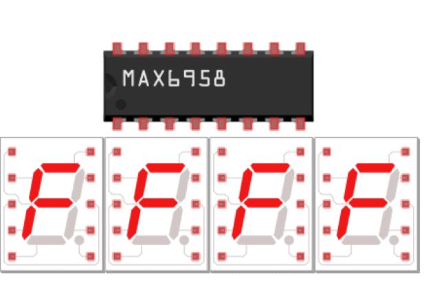
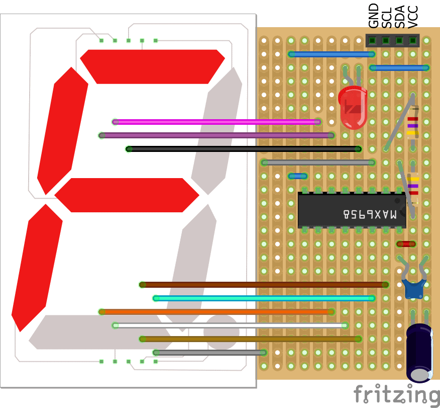
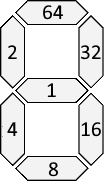

> Open this page at [https://devegied.github.io/pxt-max6958/](https://devegied.github.io/pxt-max6958/)

# Digit Display (MAX6958)
makecode Digit Display (MAX6958) extension for micro:bit

LED Digit Display with 1-4 7-segment LED, it can show numbers. It has MAX6958 chip controled with a 2-wire interface.





## Use as Extension

This repository can be added as an **extension** in MakeCode.

* open [https://makecode.microbit.org/](https://makecode.microbit.org/)
* click on **New Project**
* click on **Extensions** under the gearwheel menu
* search for **devegied/pxt-max6958** and import

## Edit this project 

To edit this repository in MakeCode.

* open [https://makecode.microbit.org/](https://makecode.microbit.org/)
* click on **Import** then click on **Import URL**
* paste **https://github.com/devegied/pxt-max6958** and click import

## API

```package
MAX6958=github:devegied/pxt-max6958
```
```sig
MAX6958.init(5, 4, MAX6958.ADDRESS.AA38)
```
Optionaly initialize the display controller by defining intensity, digit count and i2c address
  - intensity - the brightness of the LED, eg: 5
  - count - the count of digits, eg: 4
  - address - the i2c bus address of driver, eg: 0x38

```sig
MAX6958.on()
```
Turn on display

```sig
MAX6958.off()
```
Turn off display

```sig
MAX6958.clear()
```
Clear (and turn on) display

```sig
MAX6958.showLED(1, true)
```
Light on or off separate LEDs (not in segmented display)
 - pos - the position of separate LED, eg: 1
 - show - light on/off separate LED, eg: true

```sig
MAX6958.showDP(1, true)
```
Light on or off dot points next to the digits
 - pos - the position of digit, eg: 1
 - show - light on/off dot point, eg: true

```sig
MAX6958.showDigitAt(5, 1)
```
Show a digit at given position
 - num - digit to be shown, eg: 5
 - pos - the position of digit, eg: 1

```sig
MAX6958.lightSegmentsAt(0x7F, 1)
```
Light indicated segments at given position
 - segments - segments to light on (as a sum of segement values), eg: 127 for all 7 segments
 - pos - the position of digit, eg: 1
segments value can be calculated by adding segment values:


```sig
MAX6958.showInteger(1234)
```
Show a decimal integer number (between -999 and 9999 on four digits display)
 - num - a number to show, eg: 1234
If value is to small (when negative) or to big display shows "-" in all places

```sig
MAX6958.showHex(0xABCD)
```
Show a hexadecimal integer number (between -0x0FFF and 0xFFFF on four digits display)
 - num - a number to show, eg: 0xABCD
If value is to small (when negative) or to big display shows "-" in all places


## Blocks preview

This image shows the blocks code from the last commit in master.
This image may take a few minutes to refresh.


#### Metadata (used for search, rendering)

* for PXT/microbit
<script src="https://devegied.github.io/makecode-devegied-gh-pages-embed.js"></script><script>makeCodeRender("{{ site.makecode.home_url }}", "{{ site.github.owner_name }}/{{ site.github.repository_name }}");</script>
